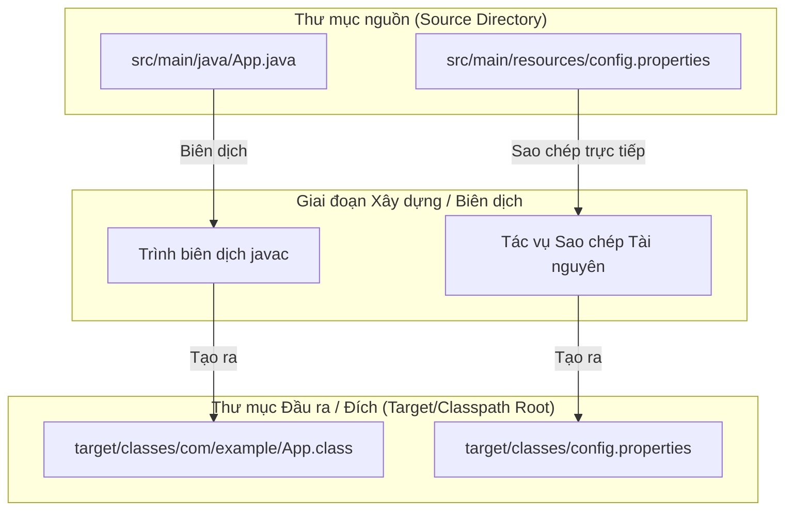
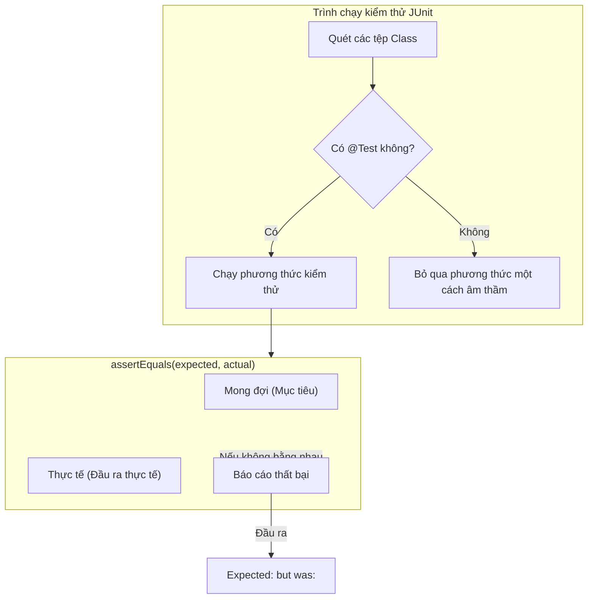

# Xây dựng, Biên dịch, Chạy (Build, Compile, Run) - Phần 2

## Mục Tiêu Học Tập

Tài liệu này trình bày về bố cục cấu trúc dự án tiêu chuẩn và kiểm thử đơn vị với JUnit. Hãy nghiên cứu từng khái niệm dưới dạng một quy tắc Java thực tế.

## Nội Dung Tổng Quan

- **`Standard project structure`** — Standard project structure: Cung cấp các quy tắc và cơ chế hoạt động cụ thể trong Java.
- **`Basic unit test with JUnit`** — Basic unit test with JUnit: Cung cấp các quy tắc và cơ chế hoạt động cụ thể trong Java.

## Ghi Chú Chi Tiết

### Cấu trúc dự án tiêu chuẩn (Standard project structure)

Các dự án Java tuân theo một bố cục thư mục quy ước được định nghĩa bởi các công cụ xây dựng hiện đại (Maven/Gradle). Việc tuân thủ quy ước này cho phép các công cụ tự động hóa quá trình biên dịch, kiểm thử và đóng gói mà không cần cấu hình đường dẫn lớp (classpath) thủ công.

- **Bố cục Thư Mục Tiêu Chuẩn**:
  ```text
  my-app/
  ├── pom.xml                   # Cấu hình dự án Maven (hoặc build.gradle cho Gradle)
  └── src/                      # Thư mục gốc cho tất cả mã nguồn và tài nguyên
      ├── main/                 # Mã nguồn chính (production code) và tài nguyên
      │   ├── java/             # Các tệp nguồn Java được tổ chức theo cấu trúc gói (package)
      │   │   └── com/
      │   │       └── example/
      │   │           └── App.java
      │   └── resources/        # Cấu hình, các thuộc tính, tệp XML, tệp tĩnh
      │       └── application.properties
      └── test/                 # Mã nguồn kiểm thử (test code) và tài nguyên
          ├── java/             # Các tệp nguồn kiểm thử khớp với cấu trúc gói chính
          │   └── com/
          │       └── example/
          │           └── AppTest.java
          └── resources/        # Các tệp tài nguyên chỉ dùng cho kiểm thử
              └── test-data.json
  ```

- **Sai Lầm Thường Gặp / Trường Hợp Lỗi**:
  - Đặt các tệp nguồn Java trực tiếp dưới `src/main/` hoặc `src/` thay vì `src/main/java/`. Các công cụ xây dựng mặc định các tác vụ biên dịch của chúng chỉ tìm kiếm bên trong `src/main/java`. Nếu đặt sai vị trí, các tác vụ trình biên dịch sẽ hoàn thành thành công nhưng biên dịch không tệp nào, dẫn đến thiếu các tệp đầu ra.
  - Thêm các tài nguyên chính vào `src/main/java/` thay vì `src/main/resources/`. Giai đoạn biên dịch chỉ sao chép các tệp tài nguyên từ các thư mục resources. Đặt chúng trong thư mục `java/` có nghĩa là chúng có thể không được sao chép vào tệp JAR cuối cùng, dẫn đến lỗi `NullPointerException` hoặc `FileNotFoundException` tại thời điểm chạy khi cố gắng tải chúng thông qua `ClassLoader.getResourceAsStream()`.

### Tại Sao Cấu Trúc Dự Án Tiêu Chuẩn Lại Tách Biệt Mã Nguồn Và Tài Nguyên

Các công cụ xây dựng như Maven và Gradle dựa trên các quy ước để tách biệt mã nguồn thực thi khỏi các tệp tài nguyên tĩnh. Các ký tự giữ chỗ và các tệp tài nguyên như properties, cấu hình XML và dữ liệu giả lập để kiểm thử (mock data) được tách vào các thư mục riêng biệt (`src/main/resources` và `src/test/resources`) bởi vì chúng được xử lý khác nhau trong đường ống biên dịch và đóng gói. Mã nguồn trong `src/main/java` phải được phân tích cú pháp, biên dịch và chuyển thành các tệp `.class`, trong khi các tài nguyên chỉ đơn giản được sao chép trực tiếp vào thư mục đầu ra của đường dẫn lớp (ví dụ: `target/classes`) mà không có bất kỳ sửa đổi nào. Nếu một tệp tài nguyên bị đặt nhầm vào `src/main/java`, tác vụ biên dịch sẽ bỏ qua nó, dẫn đến việc tệp không được đóng gói bên trong tệp JAR cuối cùng. Điều này gây ra lỗi thời điểm chạy khi ứng dụng cố gắng tải các tài nguyên này bằng bộ tải lớp (classloader).

#### Mô Hình Tư Duy: Nguyên Liệu Nấu Ăn so với Sách Công Thức
* **`src/main/java` (Sách công thức)**: Chúng cần được dịch, in và đóng thành sách (biên dịch).
* **`src/main/resources` (Nguyên liệu)**: Chúng chỉ cần được giao đến nhà bếp (sao chép sang thư mục đầu ra) như bản chất của chúng. Nếu bạn đưa các nguyên liệu vào nhà in (thư mục java), chúng sẽ bị vứt đi hoặc gây ra đống lộn xộn.



#### Ví Dụ Thực Tế
```java
// Cố gắng tải một tệp tài nguyên:
InputStream input = App.class.getClassLoader().getResourceAsStream("config.properties");
if (input == null) {
    System.out.println("Resource not found!"); 
    // Đầu ra: Resource not found! (nếu config.properties bị đặt ở src/main/java/ thay vì src/main/resources/)
} else {
    System.out.println("Resource loaded successfully.");
    // Đầu ra: Resource loaded successfully.
}
```

#### Chuỗi Nguyên Nhân - Kết Quả
Lập trình viên đặt `config.properties` bên trong `src/main/java/` &rarr; Tác vụ `compiler:compile` của Maven biên dịch các tệp Java nhưng bỏ qua các tệp không phải Java trong `src/main/java` &rarr; Thư mục đóng gói đích không chứa `config.properties` &rarr; Phương thức `getResourceAsStream()` của ClassLoader trả về `null` tại thời điểm chạy &rarr; Ứng dụng ném ra `NullPointerException` khi truy cập luồng tài nguyên.

---

### Kiểm thử đơn vị cơ bản với JUnit (Basic unit test with JUnit)

JUnit (hiện tại là JUnit 5 / Jupiter) là khung công tác chính để viết các bài kiểm thử đơn vị tự động trong hệ sinh thái JVM. Các bài kiểm thử xác minh rằng các lớp và phương thức riêng lẻ hoạt động chính xác.

- **Ví Dụ Mã Nguồn**:
  ```java
  package com.example;

  import org.junit.jupiter.api.Test;
  import static org.junit.jupiter.api.Assertions.*;

  public class CalculatorTest {

      private final Calculator calculator = new Calculator();

      @Test
      void testAdd_withPositiveNumbers_shouldReturnSum() {
          int result = calculator.add(2, 3);
          
          // Kiểm tra khẳng định: giá trị mong đợi trước, giá trị thực tế sau
          assertEquals(5, result, "2 + 3 should be 5");
      }

      @Test
      void testDivide_byZero_shouldThrowArithmeticException() {
          // Khẳng định việc ném ngoại lệ
          assertThrows(ArithmeticException.class, () -> {
              calculator.divide(10, 0);
          }, "Dividing by zero must throw ArithmeticException");
      }
  }
  ```

- **Sai Lầm Thường Gặp / Trường Hợp Lỗi**:
  - **Quên chú thích `@Test`**: Nếu bạn bỏ qua `@Test` (từ gói `org.junit.jupiter.api`), công cụ xây dựng/IDE sẽ hoàn toàn bỏ qua phương thức này, tạo ra cảm giác an toàn giả tạo rằng tất cả các bài kiểm thử đều đã vượt qua.
  - **Đảo ngược các đối số trong Khẳng định**: Viết `assertEquals(actual, expected)` thay vì `assertEquals(expected, actual)`. Nếu bài kiểm thử thất bại, thông báo lỗi của JUnit sẽ hiển thị: `Expected: [actual_value] but was: [expected_value]`, điều này gây hiểu lầm cực kỳ tai hại.
  - **Nhồi nhét Khẳng định (Assertion Overload)**: Đặt hàng tá khẳng định không liên quan trong một phương thức kiểm thử duy nhất. Nếu khẳng định đầu tiên thất bại, các khẳng định tiếp theo sẽ không được thực thi, che giấu các lỗi khác. Hãy giữ các bài kiểm thử tập trung và phân tách các khẳng định ở những nơi thích hợp.

### Tại Sao Thứ Tự Khẳng Định (Assertion) Và Chú Thích (Annotation) Trong JUnit Lại Quan Trọng

Các khung kiểm thử tự động yêu cầu các giao thức nghiêm ngặt để xác định, thực thi và báo cáo kết quả kiểm thử một cách chính xác. Trong JUnit, chú thích `@Test` báo cho trình chạy kiểm thử (test runner) biết rằng một phương thức là một kiểm thử đơn vị có thể thực thi chứ không phải là một phương thức bổ trợ. Không có chú thích này, trình chạy kiểm thử sẽ hoàn toàn bỏ qua phương thức đó, đồng nghĩa với việc các bài kiểm thử bị bỏ sót có thể không được chú ý. Hơn nữa, các khẳng định như `assertEquals(expected, actual)` phải tuân theo đúng thứ tự tham số. Khi một bài kiểm thử thất bại, JUnit sẽ tạo ra một thông báo lỗi so sánh các trạng thái mong đợi và thực tế. Nếu lập trình viên đảo ngược các đối số này, báo cáo lỗi sẽ thông báo rằng kết quả mong đợi là giá trị thời điểm chạy thực tế và ngược lại, gây hiểu lầm cho lập trình viên trong quá trình sửa lỗi và kéo dài thời gian điều tra.

#### Mô Hình Tư Duy: Xác Minh Chú Thích và Định Dạng Khẳng Định


#### Ví Dụ Thực Tế
```java
// Thứ tự đúng: mong đợi là 5, thực tế là 4
assertEquals(5, 4);
// Đầu ra trên console:
// Expected: 5
// But was:  4

// Thứ tự đảo ngược (gây hiểu lầm):
assertEquals(4, 5);
// Đầu ra trên console:
// Expected: 4
// But was:  5
```

#### Chuỗi Nguyên Nhân - Kết Quả
Lập trình viên viết khẳng định kiểm thử &rarr; Lập trình viên đảo ngược các đối số thành `assertEquals(actualResult, expectedResult)` &rarr; Khẳng định thất bại &rarr; JUnit xây dựng thông báo lỗi bằng cách sử dụng các vị trí `assertEquals(firstParam, secondParam)` &rarr; Lập trình viên đọc thông báo lỗi sai dạng "Expected: <actualResult> but was: <expectedResult>" &rarr; Lập trình viên lãng phí thời gian tìm kiếm ở sai vị trí trong mã nguồn.

---

## Các Câu Hỏi Ôn Tập Thường Gặp

- Thư mục nào chứa cấu hình chính so với dữ liệu giả lập để kiểm thử? (`src/main/resources` so với `src/test/resources`)
- Rủi ro của việc kiểm thử các chi tiết triển khai private là gì? (Nó liên kết chặt chẽ các bài kiểm thử với các chi tiết nội bộ, khiến việc tái cấu trúc trở nên khó khăn. Các bài kiểm thử nên xác minh các giao diện API công khai và hành vi có thể quan sát được).
- Các công cụ xây dựng tương tác với kết quả kiểm thử JUnit như thế nào? (Các đường ống xây dựng thường chạy tác vụ `test`; nếu có bất kỳ khẳng định kiểm thử nào thất bại, quá trình xây dựng sẽ thất bại, ngăn chặn việc triển khai mã nguồn có lỗi).
