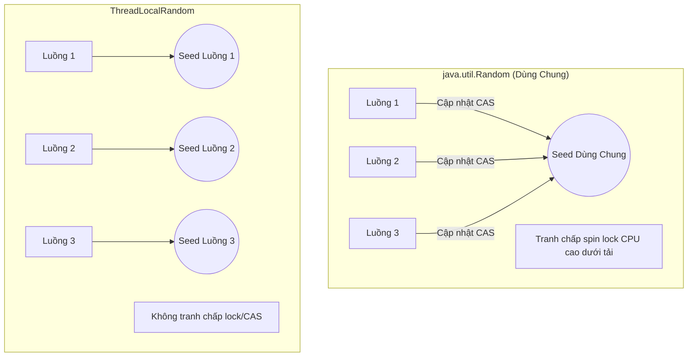
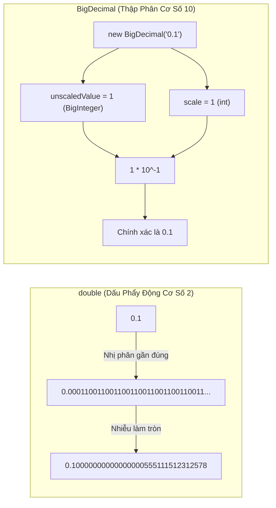

# Một Số Utility API Thông Dụng — Phần 1

File này trình bày một lát cắt có trọng tâm về **Một Số Utility API Thông Dụng** gồm API toán học, độ chính xác tùy ý, hệ thống và thực thi tiến trình. Học từng khái niệm như một quy tắc Java thực tiễn.

## Nội Dung Đề Cương

---

## Ghi Chú Chi Tiết

### Math

Lớp `java.lang.Math` chứa các phương thức tĩnh thực hiện các phép tính số cơ bản như mũ, logarithm, căn bậc hai và lượng giác.

- **Ví dụ chạy được**:
  ```java
  double squareRoot = Math.sqrt(25.0); // 5.0
  int absoluteValue = Math.abs(-10);   // 10
  long rounded = Math.round(5.6);     // 6
  ```

- **Lỗi Thường Gặp / Chế Độ Thất Bại**:
  - **Lỗ Hổng Tràn Số (Overflow Vulnerability)**: Các phương thức tiêu chuẩn không kiểm tra tràn số. Ví dụ, `Math.abs(Integer.MIN_VALUE)` trả về `Integer.MIN_VALUE` vì giá trị tuyệt đối của $-2^{31}$ không thể biểu diễn dưới dạng số nguyên có dấu 32-bit bù hai dương.
  - **Giải pháp**: Dùng các phương thức số học chính xác từ Java 8 (ví dụ `Math.addExact`, `Math.multiplyExact`, `Math.absExact`) — những phương thức này ném `ArithmeticException` khi tràn số:
    ```java
    try {
        int overflowed = Math.addExact(Integer.MAX_VALUE, 1);
    } catch (ArithmeticException e) {
        System.out.println("Overflow detected!");
    }
    ```

---

### Random

Lớp `java.util.Random` tạo số giả ngẫu nhiên sử dụng thuật toán Bộ Tạo Tuyến Tính Hợp Đồng (Linear Congruential Generator — LCG).

- **Ví dụ chạy được**:
  ```java
  Random rand = new Random();
  int randomInt = rand.nextInt(100);    // 0 (bao gồm) đến 100 (không bao gồm)
  double randomDouble = rand.nextDouble(); // 0.0 đến 1.0
  ```

- **Lỗi Thường Gặp / Chế Độ Thất Bại**:
  - **Rủi Ro Bảo Mật**: `Random` không an toàn về mặt mật mã (cryptographically secure) và có thể bị đoán trước. Không bao giờ dùng để tạo dữ liệu nhạy cảm (mật khẩu, token phiên, khóa mật mã). Dùng `java.security.SecureRandom` thay thế.
  - **Tranh Chấp Đa Luồng (Multithreading Contention)**: Dù thread-safe, một instance `Random` dùng chung gây giảm hiệu suất khi tranh chấp cao. Dùng `java.util.concurrent.ThreadLocalRandom.current().nextInt()` cho môi trường đồng thời.

### Tại Sao Random và Math.random() Có Lỗ Hổng Trong Đồng Thời và Bảo Mật

`java.util.Random` và `Math.random()` được xây dựng trên thuật toán LCG. Thiết kế này tạo ra các giới hạn nghiêm trọng trong cả ứng dụng đa luồng và nhạy cảm bảo mật.

#### 1. Tranh Chấp Đa Luồng (Nút Thắt Cổ Chai Thread-Safety)
Để thread-safe, `java.util.Random` dùng một `AtomicLong` nội tại để lưu seed. Khi nhiều luồng gọi `nextInt()` hay `Math.random()` đồng thời, chúng cùng cố cập nhật seed atomic này bằng vòng lặp So Sánh và Hoán Đổi (Compare-And-Swap — CAS). Dưới tải cao, các luồng liên tục thất bại CAS và quay vòng, lãng phí CPU và giảm hiệu suất nghiêm trọng.
- **Giải pháp (`ThreadLocalRandom`)**: Java 7 giới thiệu `java.util.concurrent.ThreadLocalRandom`. Nó cấp phát một seed riêng cho mỗi luồng, loại bỏ hoàn toàn trạng thái chia sẻ và tranh chấp seed.

#### 2. Khả Năng Đoán Trước Về Mật Mã (Lỗ Hổng Bảo Mật)
LCG là công thức xác định (deterministic): $X_{n+1} = (aX_n + c) \pmod m$. Nếu kẻ tấn công thu thập một chuỗi nhỏ các số được tạo, họ có thể dễ dàng tính toán seed hiện tại và đoán tất cả đầu ra tương lai.
- **Giải pháp (`SecureRandom`)**: `java.security.SecureRandom` dùng bộ tạo số giả ngẫu nhiên mạnh về mật mã (CSPRNG) được khởi tạo từ entropy cấp hệ điều hành (như `/dev/urandom` trên Unix). Nó được thiết kế để chống đoán trước, tuy nhiên chậm hơn do thu thập entropy.

#### So Sánh Bằng Phép Ẩn Dụ
Hãy tưởng tượng một máy bán đồ uống đơn lẻ trong văn phòng đông người (`Random` dùng chung). Mỗi nhân viên phải cập nhật một cuốn sổ trước khi lấy đồ. Nếu nhiều người cùng cố ghi vào sổ, họ chen chúc và chặn nhau (tranh chấp). `ThreadLocalRandom` giống như mỗi nhân viên có máy bán hàng và sổ riêng. `SecureRandom` giống như két sắt ngân hàng dùng các sự kiện hỗn loạn bên ngoài (như tiếng ồn khí quyển) để tạo mã; mở rất chậm nhưng không thể đoán được.



#### Chuỗi Nhân Quả Của Tranh Chấp Luồng
```text
Instance Random dùng chung → Nhiều luồng yêu cầu số đồng thời → Luồng cố CAS AtomicLong trên cùng seed → Chỉ một luồng thành công → Các luồng còn lại thất bại CAS và quay vòng → CPU sử dụng cao và độ trễ nghiêm trọng
```

#### Ví Dụ Chạy Được
```java
import java.util.Random;
import java.util.concurrent.ThreadLocalRandom;
import java.security.SecureRandom;

public class RandomDemo {
    public static void main(String[] args) {
        // Math.random() nội bộ dùng một instance Random tĩnh dùng chung
        double randomVal = Math.random(); // 0.0 đến 1.0 (tranh chấp trong đa luồng)
        System.out.println("Math.random(): " + randomVal);

        // ThreadLocalRandom: Không tranh chấp, nhưng có thể đoán (đừng dùng cho bảo mật)
        int localRandom = ThreadLocalRandom.current().nextInt(1, 100);
        System.out.println("ThreadLocalRandom: " + localRandom); // ví dụ 42

        // SecureRandom: An toàn mật mã, chậm hơn, không thể đoán trước
        SecureRandom secure = new SecureRandom();
        byte[] token = new byte[16];
        secure.nextBytes(token); // Điền mảng với các byte an toàn, không thể đoán
        System.out.println("Secure token generated successfully.");
    }
}
```

---

### BigInteger

`java.math.BigInteger` biểu diễn các số nguyên độ chính xác tùy ý. Nó bất biến và hoạt động như kiểu nguyên thủy nhưng không giới hạn số bit.

- **Ví dụ chạy được**:
  ```java
  BigInteger largeVal = new BigInteger("123456789012345678901234567890");
  BigInteger multiplier = BigInteger.valueOf(10);
  BigInteger result = largeVal.multiply(multiplier);
  ```

- **Lỗi Thường Gặp / Chế Độ Thất Bại**:
  - **Bỏ Qua Tính Bất Biến**: Các phép tính số học trên `BigInteger` không thay đổi instance. Thay vào đó, chúng trả về một `BigInteger` mới.
    ```java
    BigInteger val = BigInteger.TEN;
    val.add(BigInteger.ONE); // SAI: kết quả bị bỏ!
    val = val.add(BigInteger.ONE); // ĐÚNG: val giờ là 11
    ```

---

### BigDecimal

`java.math.BigDecimal` biểu diễn số thập phân độ chính xác tùy ý, cung cấp kiểm soát hoàn toàn về scale và cách làm tròn.

- **Ví dụ chạy được**:
  ```java
  BigDecimal val1 = new BigDecimal("0.1");
  BigDecimal val2 = new BigDecimal("0.2");
  BigDecimal sum = val1.add(val2); // Chính xác là 0.3
  ```

- **Lỗi Thường Gặp / Chế Độ Thất Bại**:
  - **Khởi Tạo Bằng Literal Double**: Khởi tạo qua literal `double` đưa vào nhiễu dấu phẩy động.
    ```java
    BigDecimal bad = new BigDecimal(0.1); // Giá trị là 0.10000000000000000555111...
    BigDecimal good = new BigDecimal("0.1"); // Giá trị chính xác là 0.1
    ```
  - **Chia Số Thập Phân Không Kết Thúc**: Chia mà không chỉ định chế độ làm tròn khi kết quả vô hạn (như 1/3) sẽ ném `ArithmeticException`.
    ```java
    BigDecimal one = BigDecimal.ONE;
    BigDecimal three = new BigDecimal("3");
    // BigDecimal res = one.divide(three); // SAI: Ném ArithmeticException
    BigDecimal res = one.divide(three, 2, RoundingMode.HALF_UP); // ĐÚNG: 0.33
    ```

### Tại Sao BigDecimal Chính Xác: Cơ Chế Biểu Diễn Unscaled Value và Scale

Máy tính biểu diễn kiểu `double` và `float` theo định dạng dấu phẩy động IEEE 754 (cơ số 2). Vì các số phân số như `0.1` hay `0.2` không có biểu diễn kết thúc trong hệ nhị phân ($0.1_{10} = 0.0001100110011..._2$), việc lưu chúng ở định dạng độ chính xác kép gây ra lỗi làm tròn nhỏ. Những lỗi này tích lũy qua nhiều phép tính, khiến chúng nguy hiểm cho tính toán tài chính.

#### Cơ Chế Biểu Diễn Nội Tại
`java.math.BigDecimal` tránh các vấn đề nhị phân dấu phẩy động bằng cách lưu trữ số dưới dạng thập phân cơ số 10. Nó dùng hai giá trị nội tại:
1. **Giá Trị Chưa Scale (Unscaled Value)**: Một số nguyên độ chính xác tùy ý (`BigInteger`) biểu diễn các chữ số không có dấu thập phân.
2. **Scale**: Một số nguyên 32-bit biểu diễn lũy thừa của mười để chia giá trị chưa scale.

Giá trị toán học của một `BigDecimal` là:
$$\text{Giá trị} = \text{unscaledValue} \times 10^{-\text{scale}}$$

##### Bảng Ví Dụ Biểu Diễn

#### Rủi Ro Khởi Tạo Sớm Bằng Literal Double
Khi bạn viết `new BigDecimal(0.1)`, trình biên dịch trước tiên đánh giá literal `double` `0.1`, vốn đã không chính xác trong hệ nhị phân. Constructor `BigDecimal` sau đó nắm bắt giá trị không chính xác đó.
Dùng `new BigDecimal("0.1")` hay `BigDecimal.valueOf(0.1)` phân tích chuỗi ký tự, cho phép `BigDecimal` trích xuất trực tiếp các giá trị cơ số 10 chính xác. Lưu ý `BigDecimal.valueOf(double)` nội bộ gọi `Double.toString(double)`, chuyển đổi double sang biểu diễn chuỗi chuẩn trước khi phân tích.

#### So Sánh Bằng Phép Ẩn Dụ
Hãy nghĩ `double` như cố ghi $1/3$ ở định dạng thập phân lên mẩu giấy nhớ. Bạn sẽ viết `0.33333333` nhưng cuối cùng hết chỗ, để lại lỗi nhỏ.
`BigDecimal` giống như ghi phân số dưới dạng cặp số nguyên: tử số `1` và mẫu số `3`. Nó lưu trữ các chữ số chính xác (`unscaledValue`) và ghi nhớ vị trí dấu thập phân (`scale`), không bao giờ mất thông tin.



#### Chuỗi Nhân Quả Của Nhiễu Literal Double
```text
Literal double 0.1 → Biểu diễn nhị phân có phân số lặp → Giá trị được làm tròn đến số dấu phẩy động IEEE 754 gần nhất → new BigDecimal(double) phân tích số dấu phẩy động đã làm tròn → BigDecimal kế thừa nhiễu dấu phẩy động
```

#### Ví Dụ Chạy Được
```java
import java.math.BigDecimal;
import java.math.RoundingMode;

public class BigDecimalDemo {
    public static void main(String[] args) {
        // Tích lũy nhiễu dấu phẩy động
        double d1 = 0.1;
        double d2 = 0.2;
        System.out.println("Tổng double: " + (d1 + d2)); // 0.30000000000000004 (không phải 0.3!)

        // SAI: Khởi tạo bằng literal double giữ lại nhiễu
        BigDecimal bad = new BigDecimal(0.1);
        System.out.println("new BigDecimal(0.1): " + bad); // 0.10000000000000000555111512312578...

        // ĐÚNG: Khởi tạo bằng String để có giá trị chính xác
        BigDecimal good1 = new BigDecimal("0.1");
        BigDecimal good2 = new BigDecimal("0.2");
        System.out.println("Tổng BigDecimal: " + good1.add(good2)); // 0.3 (chính xác!)

        // ĐÚNG: BigDecimal.valueOf(double) dùng chuyển đổi String nội bộ
        BigDecimal good3 = BigDecimal.valueOf(0.1);
        System.out.println("BigDecimal.valueOf(0.1): " + good3); // 0.1

        // Phép chia có và không có RoundingMode
        BigDecimal one = BigDecimal.ONE;
        BigDecimal three = new BigDecimal("3");
        try {
            one.divide(three); // Ném ArithmeticException (khai triển thập phân vô hạn 0.333...)
        } catch (ArithmeticException e) {
            System.out.println("Bắt được exception phép chia không kết thúc như mong đợi.");
        }
        BigDecimal quotient = one.divide(three, 4, RoundingMode.HALF_UP);
        System.out.println("Thương với scale 4: " + quotient); // 0.3333
    }
}
```

---

### UUID

`java.util.UUID` biểu diễn một định danh duy nhất toàn cầu (Universally Unique Identifier) 128-bit.

- **Ví dụ chạy được**:
  ```java
  UUID uniqueId = UUID.randomUUID(); // UUID kiểu 4 mạnh về mật mã
  String uuidStr = uniqueId.toString();
  UUID parsed = UUID.fromString(uuidStr);
  ```

- **Lỗi Thường Gặp / Chế Độ Thất Bại**:
  - Phân tích đầu vào chưa kiểm tra: `UUID.fromString(input)` ném `IllegalArgumentException` tại runtime nếu chuỗi không tuân theo cấu trúc hex UUID. Luôn bao bọc trong kiểm tra hợp lệ hoặc try-catch.

---

### Objects

`java.util.Objects` gồm các phương thức tiện ích tĩnh để thao tác trên đối tượng (kiểm tra null, so sánh, tính hash, v.v.).

- **Ví dụ chạy được**:
  ```java
  boolean isSame = Objects.equals(objA, objB); // So sánh an toàn null
  int hashValue = Objects.hash(field1, field2); // Tạo hash code an toàn null
  Objects.requireNonNull(name, "Name cannot be null"); // Kiểm tra null trực tiếp
  ```

- **Lỗi Thường Gặp / Chế Độ Thất Bại**:
  - Dùng `Objects.equals(array1, array2)` để so sánh giá trị mảng. Nó chỉ kiểm tra bằng tham chiếu, trả về `false` với các mảng giống hệt nhau nhưng ở địa chỉ bộ nhớ khác nhau. Dùng `Arrays.equals(array1, array2)` thay thế.

---

### Optional

`java.util.Optional` là đối tượng container được giới thiệu trong Java 8 để biểu diễn sự có mặt hay vắng mặt của một giá trị khác null, nhằm loại bỏ `NullPointerException` (NPE).

- **Ví dụ chạy được**:
  ```java
  Optional<String> opt = Optional.ofNullable(getStringThatMayBeNull());
  String val = opt.orElse("Giá trị dự phòng");
  
  // Đánh giá lười: supplier dự phòng chỉ chạy nếu opt rỗng
  String lazyVal = opt.orElseGet(() -> computeDefaultValue());
  ```

- **Lỗi Thường Gặp / Chế Độ Thất Bại**:
  - **Đánh Giá Nhanh (Eager) trong `orElse`**: Truyền một lời gọi phương thức vào `orElse` khiến phương thức đó chạy *mỗi lần*, bất kể Optional có rỗng hay không.
    ```java
    // SAI: fetchDefault() chạy ngay cả khi opt có giá trị!
    String value = opt.orElse(fetchDefault());
    
    // ĐÚNG: fetchDefault() chỉ chạy nếu opt rỗng.
    String value = opt.orElseGet(() -> fetchDefault());
    ```
  - **Lạm Dụng Optional**: Không dùng `Optional` cho tham số phương thức/constructor, trường lớp, hay bao bọc kiểu collection (hãy trả về collection rỗng). Nó được thiết kế chủ yếu làm kiểu trả về cho các phương thức cần chỉ rõ "không có kết quả".

---

### System

`java.lang.System` cung cấp truy cập vào tài nguyên hệ thống, luồng I/O tiêu chuẩn, thuộc tính môi trường và bộ điều khiển thu gom rác.

- **Ví dụ chạy được**:
  ```java
  long start = System.nanoTime(); // Thời gian trôi qua độ chính xác cao tính bằng nanosecond
  String tempDir = System.getProperty("java.io.tmpdir"); // Lấy thuộc tính JVM
  String path = System.getenv("PATH"); // Lấy biến môi trường OS
  ```

- **Lỗi Thường Gặp / Chế Độ Thất Bại**:
  - **Dùng CurrentTimeMillis cho Bộ Đếm Thời Gian**: Dùng `System.currentTimeMillis()` để đo thời gian chạy của phương thức là rủi ro vì nó đo giờ tường (wall-clock time). Nếu NTP đồng bộ hay người dùng thay đổi đồng hồ OS trong khi chạy, kết quả có thể âm hoặc rất không chính xác. Dùng `System.nanoTime()` để đo khoảng thời gian.

---

### Runtime

`java.lang.Runtime` cho phép ứng dụng giao tiếp với môi trường runtime JVM (truy vấn bộ nhớ, thêm shutdown hook, v.v.).

- **Ví dụ chạy được**:
  ```java
  Runtime runtime = Runtime.getRuntime();
  long freeMemory = runtime.freeMemory(); // Bộ nhớ trống trong JVM heap
  runtime.addShutdownHook(new Thread(() -> {
      System.out.println("Đang tắt JVM một cách duyên dáng...");
  }));
  ```

- **Lỗi Thường Gặp**: Cố ép thu gom rác bằng `Runtime.getRuntime().gc()`. Đây chỉ là gợi ý cho JVM; bộ thu gom rác có thể bỏ qua hoàn toàn lời gọi này, và gọi lặp lại làm giảm hiệu suất.

### System và Runtime: Mục Đích và Tương Tác JVM

Mặc dù cả `java.lang.System` và `java.lang.Runtime` đều cho phép lập trình viên giao tiếp với môi trường chạy ứng dụng, chúng phục vụ các vai trò thiết kế khác nhau và tương tác với JVM ở các mức trừu tượng khác nhau.

#### Điểm Khác Biệt Chính và Ý Định Thiết Kế
  `System` là lớp final chỉ chứa trường và phương thức `static`. Không thể khởi tạo. Nó đóng vai trò lớp tiện ích cấp cao để truy cập luồng I/O tiêu chuẩn (`System.in`, `System.out`, `System.err`), thuộc tính hệ thống, biến môi trường, sao chép mảng (`System.arraycopy`) và bộ đếm thời gian hệ thống cấp thấp (`currentTimeMillis` và `nanoTime`).
  `Runtime` đại diện cho instance đang hoạt động duy nhất của Java Virtual Machine. Nó tuân theo mẫu thiết kế Singleton (Đơn Thể); bạn lấy instance hiện tại bằng `Runtime.getRuntime()`. Vì nó đại diện cho chính tiến trình máy ảo, nó cung cấp các phương thức kiểm tra mức sử dụng bộ nhớ (`freeMemory()`, `totalMemory()`, `maxMemory()`), đăng ký shutdown hook và khởi tạo tiến trình con.

#### Các Phương Thức Ủy Quyền
Để làm các thao tác JVM thông dụng dễ viết hơn, `System` cung cấp một số phương thức bao bọc tiện lợi ủy quyền trực tiếp cho singleton `Runtime`.
- `System.gc()` là viết tắt của `Runtime.getRuntime().gc()`.
- `System.exit(status)` là viết tắt của `Runtime.getRuntime().exit(status)`.

#### So Sánh Bằng Phép Ẩn Dụ
Hãy nghĩ JVM như một con tàu du lịch.
`Runtime` giống thuyền trưởng và boong chỉ huy. Chỉ có một thuyền trưởng (`Runtime.getRuntime()`), và bạn phải nói chuyện với thuyền trưởng để truy vấn buồng máy (kiểm tra bộ nhớ), lên kế hoạch quy trình khẩn cấp (đăng ký shutdown hook) hay lệnh cho tàu dừng (thoát).
`System` giống quầy dịch vụ khách của tàu. Đây là nơi dễ tiếp cận, tĩnh. Nếu bạn nhờ dịch vụ khách dọn cabin (`System.gc()`), họ không tự làm; họ chuyển yêu cầu đến bộ phận thuyền trưởng. Nó cũng cung cấp các tiện ích chung như xem lịch hàng ngày (thuộc tính hệ thống) hay đọc thông báo chính thức (luồng hệ thống).

```mermaid
flowchart TD
    App[Ứng Dụng] -->|Gọi Helper Tĩnh| System[Lớp System]
    App -->|Yêu Cầu Singleton| Runtime[Lớp Runtime]
    System -->|System.exit() ủy quyền| Runtime
    System -->|System.gc() ủy quyền| Runtime
    Runtime -->|Điều Khiển Trực Tiếp| JVM[Tiến Trình JVM]
    JVM -->|Thông Tin Môi Trường| OS[Hệ Điều Hành Host]
```

#### Chuỗi Nhân Quả Của Shutdown Hook JVM Duyên Dáng
```text
Gọi Runtime.addShutdownHook() → JVM đăng ký luồng hook → Người dùng kết thúc tiến trình hoặc System.exit() được gọi → JVM bắt đầu chuỗi tắt → JVM chạy tất cả các luồng hook đã đăng ký đồng thời → Tiến trình JVM thoát
```

#### Ví Dụ Chạy Được
```java
public class SystemRuntimeDemo {
    public static void main(String[] args) {
        // --- Dùng System (Bộ Bao Bọc Tĩnh) ---
        long start = System.nanoTime();
        String osName = System.getProperty("os.name");
        System.out.println("Đang chạy trên: " + osName); // In tên OS
        
        // --- Dùng Runtime (Singleton JVM) ---
        Runtime rt = Runtime.getRuntime();
        System.out.println("Số processor: " + rt.availableProcessors());
        System.out.println("Bộ nhớ JVM trống: " + rt.freeMemory() + " bytes");

        // --- Minh Họa Ủy Quyền ---
        // Đăng ký shutdown hook phải thực hiện trực tiếp trên instance Runtime
        rt.addShutdownHook(new Thread(() -> {
            System.out.println("Dọn dẹp tắt duyên dáng hoàn tất trong hook.");
        }));

        // System.gc() đơn giản ủy quyền cho Runtime.getRuntime().gc() bên dưới
        System.gc(); 

        long duration = System.nanoTime() - start;
        System.out.println("Demo mất: " + duration + " ns");
    }
}
```

---

### ProcessBuilder

`ProcessBuilder` được dùng để tạo và khởi động các tiến trình hệ điều hành.

- **Ví dụ chạy được**:
  ```java
  ProcessBuilder builder = new ProcessBuilder("ls", "-la");
  builder.redirectErrorStream(true); // Kết hợp stderr và stdout
  Process process = builder.start();
  ```

- **Lỗi Thường Gặp / Chế Độ Thất Bại**:
  - **Tiến Trình Treo (Hanging Processes)**: Nếu bạn tạo tiến trình bên ngoài tạo ra đầu ra đáng kể mà bạn không đọc luồng đầu ra, buffer OS sẽ đầy. Khi đầy, tiến trình đã tạo bị chặn vô thời hạn, khiến chương trình Java bị treo. Chuyển hướng đầu ra (`builder.inheritIO()` hay `builder.redirectOutput(file)`) hoặc chủ động đọc từ `process.getInputStream()`.
